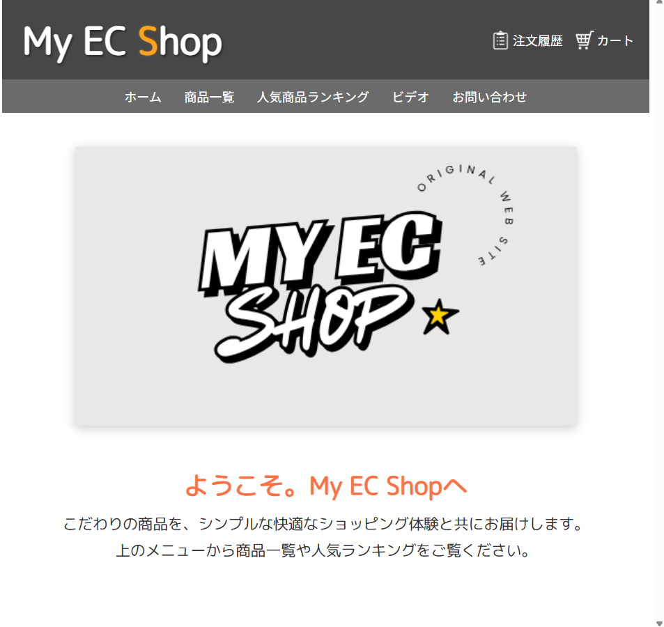

---
# 🛒 My EC App  
バニラ技術で構築したシンプルなECサイト型ポートフォリオ  

---

## 🌐 概要
このアプリは **HTML / CSS / JavaScript（バニラ） / PHP / MySQL** を使用して構築した  
学習兼ポートフォリオ用のECサイトです。  
フレームワークを使用せず、ルーティングやテンプレート展開、データ処理を  
すべて自作で実装しています。

---

## 🚀 主な機能

| カテゴリ | 内容 |
|-----------|------|
| 🏠 ホーム | ロゴと案内文を中央に配置 |
| 💿 商品一覧 | MySQLから商品情報を取得・表示 |
| 🛍️ カート機能 | 商品の追加 / 削除 / 数量変更 / 合計金額計算 |
| 📦 注文履歴 | 注文内容と日付を保存・表示 |
| 🥇 人気ランキング | 売上数に基づく1位～3位の強調表示 |
| 🎥 ビデオセクション | `video_demo.mp4` を中央にループ再生 |
| 📩 お問い合わせ | 入力内容をDB（`contact_messages`）に保存 |
| ❓ FAQ | よくある質問を `<details>` 要素で静的表示（アニメ付き） |

---

## 🧩 使用技術

| 分野 | 使用技術 |
|------|-----------|
| フロントエンド | HTML / CSS / JavaScript（Vanilla） |
| バックエンド | PHP（自作API構成） |
| データベース | MySQL（phpMyAdmin管理） |
| デザイン | Zen Maru Gothic + System UI |
| 開発環境 | XAMPP（Apache + MariaDB） |

---

## 💻 動作環境構築

### 1️⃣ 必要ソフトのインストール
以下をインストールしてください：

- [XAMPP](https://www.apachefriends.org/jp/index.html)  
  （Apache + MySQL + PHP を含む）

インストール後、「Apache」「MySQL」を **Start（起動）** します。

---

### 2️⃣ このリポジトリをクローン

```bash
git clone https://github.com/ユーザー名/myEC_app.git
````

XAMPP の **htdocs** フォルダに配置します。
例：

```
C:\xampp\htdocs\myEC_app\
```

---

### 3️⃣ データベースの準備

1. ブラウザで [http://localhost/phpmyadmin/](http://localhost/phpmyadmin/) にアクセス
2. 新規データベースを作成

   ```
   データベース名: myec_app
   ```
3. 上部メニューの「インポート」を選択
4. 本リポジトリ内の **myec_app.sql** を選択して実行

これで以下のテーブルが作成されます：

| テーブル名              | 用途       |
| ------------------ | -------- |
| `products`         | 商品情報     |
| `cart`             | カート内アイテム |
| `orders`           | 注文情報     |
| `order_items`      | 注文明細     |
| `contact_messages` | お問い合わせ履歴 |

---

### 4️⃣ サーバを起動して動作確認

XAMPPの「Apache」を起動した状態で、ブラウザから以下にアクセス：

```
http://localhost/myEC_app/
```

これでトップページ（ホーム）が表示されます。
商品一覧・ランキング・ビデオ・お問い合わせページも動作するはずです。

---

## 📁 ディレクトリ構成

```
myEC_app/
├─ index.html
├─ add_cart.php
├─ contact_submit.php
├─ delete_cart.php
├─ get_cart.php
├─ get_orders.php
├─ get_product.php
├─ get_products.php
├─ get_ranking.php
├─ purchase.php
├─ update_cart.php
├─ /css/
│   ├─ cart.css
│   ├─ common.css
│   ├─ ranking.css
│   ├─ home.css
│   ├─ video.css
│   ├─ products.css
│   ├─ orders.css
│   └─ contact.css
├─ /js/
│   ├─ main.js
│   ├─ products.js
│   ├─ ranking.js
│   ├─ contact.js
│   ├─ cart.js
│   └─ orders.js
├─ /images/
│   ├─ 各種画像ファイル（ロゴ・商品画像・アイコンなど）
└─ myec_app.sql
```

---

## 🧠 学んだこと

* **ファイル分割の重要性**
  CSS / JS / PHP の役割を明確に分けることで保守性が向上。
* **バックエンド通信の基礎**
  `fetch()` × PHP × MySQL の連携を通してデータ処理の流れを理解。
* **フレームワークに頼らない構造設計**
  ルーティング・ページ切り替え・API通信をすべて自作で構築。

---

## 🔮 今後の拡張予定

* ユーザーログイン機能
* レビュー投稿機能
* 管理者ページ（商品追加・編集）
* Node.js + Express への移行版開発

---

## 📸 スクリーンショット

### 🏠 ホームページ



### 🛍️ 商品一覧


### 🥇 ランキングページ


### 📩 お問い合わせフォーム


---

> 📘 本プロジェクトは、フレームワークに依存せず「Webの基礎力」を示すために制作されました。

---
